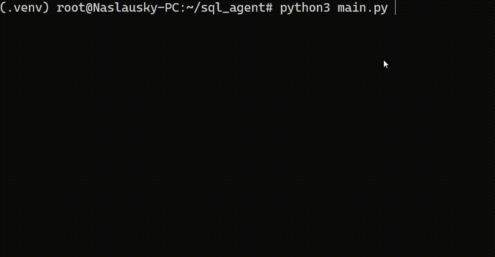
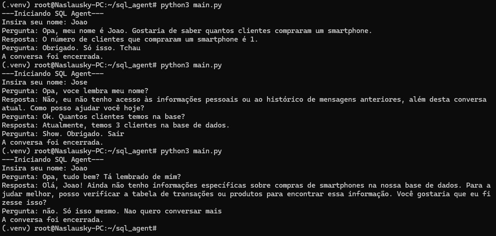

# SQL Agent
> SQL Agent Inteligente utilizando Langgraph e modelos de IA generativa.

### Gif ilustrativo de funcionamento:  
_(Este gif conta apenas com os requisitos básicos. Abaixo uma print da execução com a memória persistente multisessão)_




### Requisitos essenciais:
 - _"Criar um banco de dados PostgreSQL com tabelas inter-relacionadas"_:  
    ✅ As tabelas criadas e população dos dados é mostrada em "**Como rodar**".
 - _"Implementar um SQL Agent com LangChain para converter linguagem natural em SQL"_:  
    ✅ Foi criado um agent ReAct para montar as queries e acessar o banco.
 - _"Criar um fluxo com LangGraph para processar a consulta"_:  
    ✅ O grafo foi criado para chamada do agente, validação de saída e loop de conversa.
 - _"Executar a query gerada e retornar os resultados formatados"_:  
    ✅ O proprio agent tem esse poder com base nas ferramentas fornecidas a ele.
 - _"Garantir segurança contra SQL Injection e aplicar otimizações nas queries"_:  
    ✅ Seguranças feitas:
         1) A ferramenta de rodar as queries foi substituída por uma que valida as palavras perigosas.
         2) O prompt do agent instrui para não fazer nenhum tipo de query desta forma.
         3) Como última camada, o usuário de acesso ao banco de dados fornecido ao agente tem permissões de somente leitura.

 ### Diferenciais / Adicionais Esperados:
 Abaixo uma explicação sobre cada assunto:
 - _"RAG (Retrieval-Augmented Generation): utilize o conteúdo do banco ou documentação como fonte adicional para gerar melhores queries"_:
     O agent já tem o acesso aos schemas e a base de dados conta com poucas tabelas. Em um projeto maior ou que envolvesse mais bases de dados, poderia ser feito montando os embeddings dos documentos.
 - _"Arquitetura MCP (Model Context Protocol): padronize o contexto compartilhado entre agentes para garantir coerência e escalabilidade"_:
     Como é um projeto muito simples, o protocolo não fica tão explicito. Porém, toda a conversa está centralizada na estrutura de estado, que serve como o protocolo de padronização do contexto compartilhado entre os diferentes nós do grafo. Isso garante a coerência e a continuidade das interações.
 - _"Memória Persistente Multisessão: permita que os agentes mantenham o contexto de conversas passadas por usuário"_:
     Está implementado. Antes do início do fluxo, o sistema pergunta um id de usuário. Este id é a chave usada para armazenar na memória de longo termo. 
     Se este mesmo usuário entra novamente, o agente se lembra do que já foi conversado. Veja capturas de tela abaixo. A memória é armazenada no próprio banco de dados Postgres.
 - _"Orquestração Multi-Agente com Papéis Diferentes: implemente múltiplos agentes especializados (ex: parser NLP, validador SQL, executor, formatador de resposta)"_:
     Não foi feito. Existem nós que chamam modelos e tomam decisões mas não podem ser chamados de múltiplos agentes especializados. Neste sentido, existe apenas o agente SQL.
 - _"Observabilidade e Tracing: registre logs detalhados de interações, geração de query, execuções e eventuais erros, com visualização de métricas (ex: via OpenTelemetry)"_:
     Não foi implementado, mas como [a documentação](https://docs.smith.langchain.com/observability/how_to_guides/trace_langchain_with_otel) mostra, basta a instalação do pacote
     e a ativação do monitoramento com base na chave de API em uma variável de ambiente.

### Como rodar:
 - Vá para a raiz do projeto.
 - Instale os requisitos:
   ```pip install -r requirements.txt```
 - Adicione o seu arquivo oculto ```.env```. Segue o formato dele abaixo:
   ```   
   OPENAI_API_KEY= {APIKEY da OpenAI}
   POSTGRES_HOST={Endereço IP do servidor POSTGRESQL}
   POSTGRES_PORT={Porta do servidor POSTGRESQL}
   POSTGRES_USER={Usuario para acessar o BD}
   POSTGRES_ADMIN_USER={(Para memória multi-sessão) Usuario para acessar o BD com permissões de criação de tabelas e escrita}
   POSTGRES_PASSWORD={Senha do usuario acima}
   POSTGRES_DB={Nome do BD}
    ```
 - Lembre-se de adicionar suas próprias informações ao arquivo mencionado acima.
 - O agente já contém seguranças contra validações, mas para correta orquestração, certifique-se que o usuário simples do POSTGRESQL tenha permissões de **somente leitura**.
 - Certifique-se que o banco de dados contenha as tabelas corretas:
   ```sql
    -- Tabela de clientes
    CREATE TABLE clientes (
        id SERIAL PRIMARY KEY,
        nome TEXT NOT NULL,
        email TEXT UNIQUE NOT NULL,
        saldo NUMERIC(10, 2) DEFAULT 0.00  -- Saldo disponível do cliente
    );
    
    -- Tabela de produtos
    CREATE TABLE produtos (
        id SERIAL PRIMARY KEY,
        nome TEXT NOT NULL,
        preco NUMERIC(10, 2) NOT NULL
    );
    
    -- Tabela de transações (compra de produtos por clientes)
    CREATE TABLE transacoes (
        id SERIAL PRIMARY KEY,
        cliente_id INTEGER NOT NULL REFERENCES clientes(id) ON DELETE CASCADE,
        produto_id INTEGER NOT NULL REFERENCES produtos(id) ON DELETE SET NULL,
        data TIMESTAMP DEFAULT CURRENT_TIMESTAMP
    );
   ```
 - Certifique-se que o banco de dados esteja populado:
   ```sql
      INSERT INTO clientes (nome, email, saldo) VALUES
      ('Alice Martins', 'alice@example.com', 1500.00),
      ('Bruno Lima', 'bruno@example.com', 300.00),
      ('Carla Souza', 'carla@example.com', 2200.00),
      ('Daniel Rocha', 'daniel@example.com', 850.00),
      ('Eduarda Ramos', 'eduarda@example.com', 120.00);
      INSERT INTO produtos (nome, preco) VALUES
      ('Notebook', 2000.00),
      ('Smartphone', 900.00),
      ('Fone de Ouvido', 150.00),
      ('Teclado Mecânico', 350.00),
      ('Mouse Gamer', 200.00);
      INSERT INTO transacoes (cliente_id, produto_id, data) VALUES
      (1, 2, '2024-05-01 10:30:00'),  -- Alice comprou um Smartphone
      (2, 5, '2024-05-02 12:00:00'),  -- Bruno comprou um Mouse Gamer
      (3, 1, '2024-05-03 09:45:00'),  -- Carla comprou um Notebook
      (4, 4, '2024-05-04 14:20:00'),  -- Daniel comprou um Teclado
      (1, 3, '2024-05-05 11:10:00'),  -- Alice comprou um Fone
      (3, 5, '2024-05-06 16:30:00'),  -- Carla comprou um Mouse
      (1, 5, '2024-05-07 08:20:00');  -- Alice comprou outro Mouse
   ```
- Caso deseje, altere as configurações de temperatura e modelo [aqui](./config/llm_settings.py).
- Rode o script principal: ```python3 main.py```

## 💻 Imagens da utilização
- Memória persistente multisessão:

